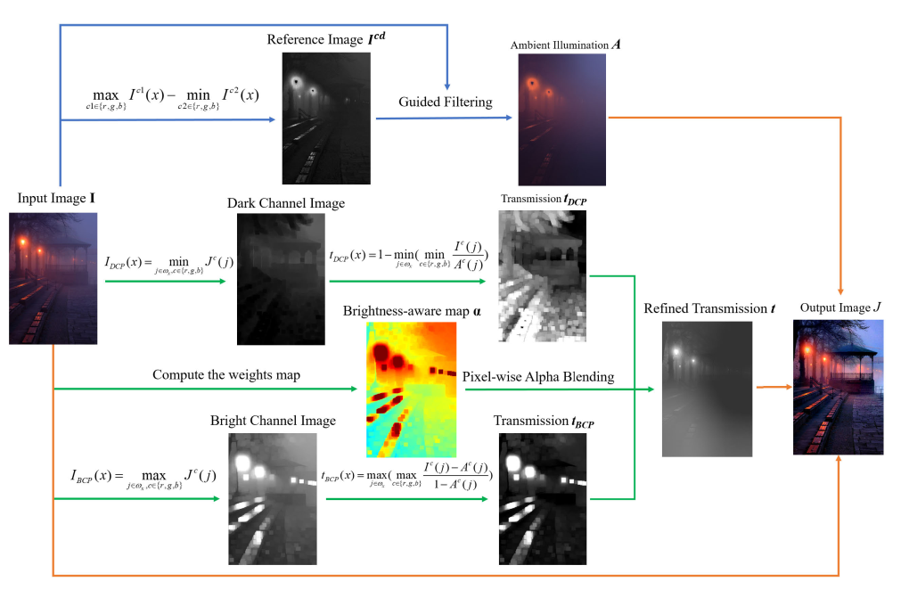

## Nighttime Single Image Dehazing via Pixel-Wise Alpha Blending

This is the source code implementing the Nighttime Single Image Dehazing described in the paper:

[T. Yu, K. Song, P. Miao, G. Yang, H. Yang and C. Chen, "Nighttime Single Image Dehazing via Pixel-Wise Alpha Blending," in IEEE Access, vol. 7, pp. 114619-114630, 2019.](https://ieeexplore.ieee.org/document/8805086)

If you find our paper useful in your research, please consider citing:

#### bibtex

    @ARTICLE{Yu2019,
      author={T. {Yu} and K. {Song} and P. {Miao} and G. {Yang} and H. {Yang} and C. {Chen}},
      journal={IEEE Access}, 
      title={Nighttime Single Image Dehazing via Pixel-Wise Alpha Blending}, 
      year={2019}, 
      volume={7},  
      pages={114619-114630},
    }

